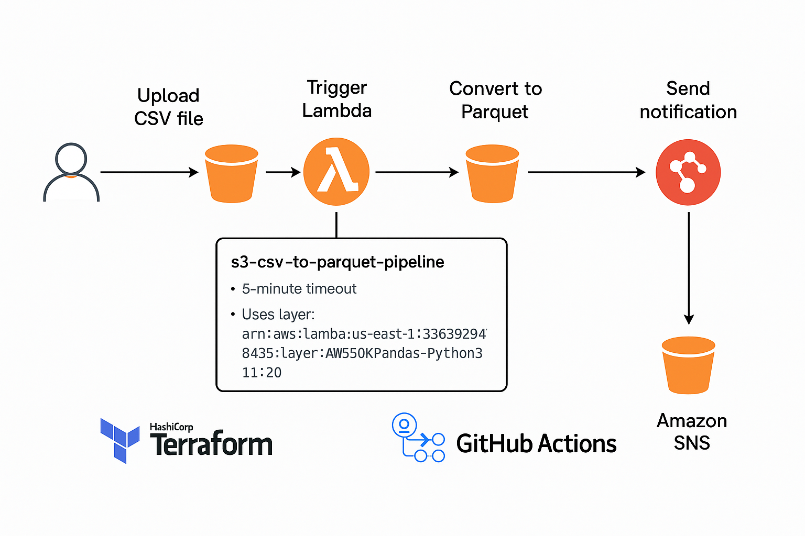

# 📚 CSV to Parquet Data Pipeline on AWS (Terraform + GitHub Actions)

---

## 📙 Project Overview

This project automates an event-driven data pipeline using AWS services.
When a CSV file is uploaded to the source S3 bucket, it automatically triggers a Lambda function that:

- Converts the CSV file to Parquet format.
- Uploads the Parquet file to the destination S3 bucket.
- Sends a notification email via SNS (Simple Notification Service).

All AWS resources are provisioned and smanaged automatically using Terraform modules and CI/CD with GitHub Actions.

---

## ⚡ Architecture



```
[User Uploads CSV to Source S3 Bucket]
                   ↓
         [S3 Event Notification]
                   ↓
            [AWS Lambda Function]
         - Converts CSV ➔ Parquet
         - Uploads to Destination S3
         - Publishes message to SNS
                   ↓
             [Email Notification]
```

---

## 🛠️ Technologies Used

- **AWS S3** (Source and Destination Buckets)
- **AWS Lambda** (CSV ➔ Parquet conversion)
- **AWS SNS** (Email Notification)
- **AWS IAM** (Permissions and Role Management)
- **Terraform** (Infrastructure as Code)
- **GitHub Actions** (CI/CD for Terraform)

---

## 📦 Project Structure

```
.
├── .github/
│   └── workflows/
│       └── terraform.yml         # GitHub Actions CI/CD pipeline
├── modules/
│   └── s3_lambda_sns/
│       ├── main.tf               # Terraform module main configuration
│       ├── variables.tf          # Module input variables
│       └── outputs.tf            # Module outputs (optional)
├── python/
│   └── lambda_function.py        # Lambda function to convert CSV to Parquet
├── main.tf                       # Root module to call s3_lambda_sns module
├── variables.tf                  # Root variables
├── terraform.tfvars              # Variables values
└── README.md                     # Project Documentation
```

---

## 🚀 Deployment Instructions

### Clone the repository

```bash
git clone https://github.com/your-username/your-repo-name.git
cd your-repo-name
```

### Configure your AWS credentials
*(Make sure you are using a named profile if needed.)*

### Initialize Terraform

```bash
terraform init
```

### Review the plan

```bash
terraform plan
```

### Apply the configuration

```bash
terraform apply -auto-approve
```

### Verify

- Upload a CSV file to the source S3 bucket.
- Check the destination S3 bucket for the converted Parquet file.
- Check your email for the notification.

---

## 💪 Automated Deployment (CI/CD)

Every push to the GitHub repository triggers GitHub Actions to automatically apply the latest changes.

---

## 🌟 Features

- 📥 **S3 Event Trigger**: Upload CSV files to automatically trigger the Lambda.
- 🔄 **Lambda Conversion**: Lambda function converts CSV to Parquet format.
- 📤 **S3 Storage**: Saves converted Parquet files to destination bucket.
- 📧 **SNS Notifications**: Sends an email notification after successful conversion.
- 🏗️ **Infrastructure as Code**: All AWS resources are managed through Terraform.
- ⚡ **Continuous Deployment**: Automated CI/CD with GitHub Actions.


---

## 📧 Contact

- **Developer:** [Your Full Name]
- **Email:** [Your Email Address]
- **GitHub:** [Your GitHub Profile Link]

---

## ✅ Status

- **Project Status:** 100% Completed
- **Working:** Successfully tested and verified.

---


# 🎉 Thank you for reviewing this project!

